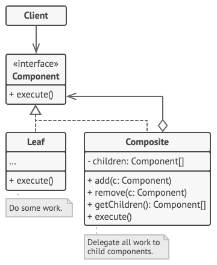
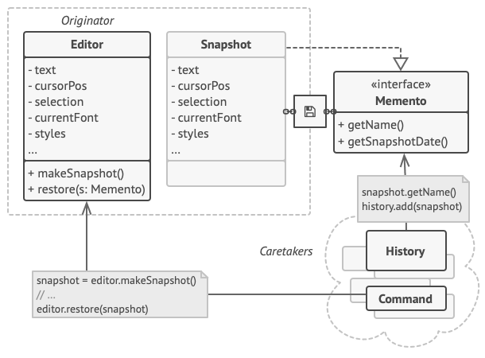
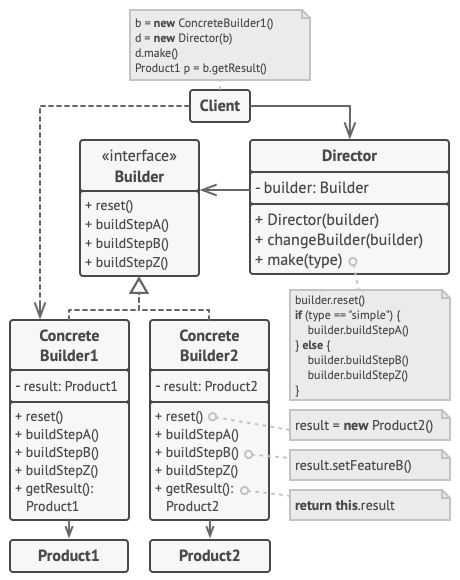

# Design Pattern Exercises

Exercises for the fourth period of the second year in Metropolia UAS. This repository contains exercises related to 
design patterns. All UML diagrams are from [Refactoring.Guru](https://refactoring.guru/design-patterns).

## Factory Method (Exercise 1)

Define an interface for creating a single object, but let subclasses decide which class to instantiate. Factory Method
lets a class defer instantiation to subclasses.

`Note: Interface -> Abstract class -> Concrete class`
- Creational pattern

## Abstract Factory (Exercise 2)

Provide an interface for creating families of related or dependent objects without specifying their concrete classes.
- Creational pattern
- Builder focuses on constructing complex objects step by step. Abstract Factory specializes in creating families of 
  related objects. Abstract Factory returns the product immediately, whereas Builder lets you run some additional 
  construction steps before fetching the product.
- Abstract Factory can serve as an alternative to Facade when you only want to hide the way the subsystem objects are 
  created from the client code.

## Composite Method (Exercise 3)

Compose objects into tree structures to represent part-whole hierarchies. Composite lets clients treat individual
objects and compositions of objects uniformly.

`Note: Compositions include one or more objects that are of the same type as the compositions itself (part-whole)`

`Note: Compositions use foreach loop to loop through their components (delegation)`
- Structural pattern
- Chain of Responsibility is often used in conjunction with Composite. In this case, when a leaf component gets a 
  request, it may pass it through the chain of all of the parent components down to the root of the object tree.
- You can use Iterators to traverse Composite trees.
- You can use Visitor to execute an operation over an entire Composite tree.
- A Decorator is like a Composite but only has one child component. There’s another significant difference: Decorator 
  adds additional responsibilities to the wrapped object, while Composite just “sums up” its children’s results.
- Designs that make heavy use of Composite and Decorator can often benefit from using Prototype. Applying the pattern 
  lets you clone complex structures instead of re-constructing them from scratch.

## Observer (Exercise 4)

Define a one-to-many dependency between objects where a state change in one object results in all its dependents being
notified and updated automatically.

`Note: Notifications are broadcast, so the changes are visible to all subscribers (observers)`

`Note: In this context pushing means the publisher sends information about a change` 

`Note: In this context pulling means the subscribers asks for information about a change`
- Behavioural pattern
- Observer lets receivers dynamically subscribe to and unsubscribe from receiving requests.
- The primary goal of Mediator is to eliminate mutual dependencies among a set of system components. Instead, these 
  components become dependent on a single mediator object. The goal of Observer is to establish dynamic one-way 
  connections between objects, where some objects act as subordinates of others.
- There’s a popular implementation of the Mediator pattern that relies on Observer. The mediator object plays the role
  of publisher, and the components act as subscribers which subscribe to and unsubscribe from the mediator’s events.
  When Mediator is implemented this way, it may look very similar to Observer.
- When you’re confused, remember that you can implement the Mediator pattern in other ways. For example, you can 
  permanently link all the components to the same mediator object. This implementation won’t resemble Observer but will
  still be an instance of the Mediator pattern.

## Singleton (Exercise 5)

Ensure a class has only one instance, and provide a global point of access to it.

`Note: Singleton can be an enum`
- Creational pattern
- There should be only one Singleton instance, whereas a Flyweight class can have multiple instances with different
  intrinsic states.
- The Singleton object can be mutable. Flyweight objects are immutable.

## Decorator (Exercise 6)

Attach additional responsibilities to an object dynamically keeping the same interface. Decorators provide a flexible
alternative to subclassing for extending functionality.
- Structural pattern
- Adapter provides a different interface to the wrapped object, Proxy provides it with the same interface, and Decorator
  provides it with an enhanced interface.
- A Decorator is like a Composite but only has one child component. There’s another significant difference: Decorator 
  adds additional responsibilities to the wrapped object, while Composite just “sums up” its children’s results.
- Decorator lets you change the skin of an object, while Strategy lets you change the guts.

## State (Exercise 7)

Allow an object to alter its behavior when its internal state changes. The object will appear to change its class.

`Note: Either the context or the state subclasses can define transitions`
- Behavioural pattern
- State can be considered as an extension of Strategy. Both patterns are based on composition: they change the behavior
  of the context by delegating some work to helper objects. Strategy makes these objects completely independent and
  unaware of each other. However, State doesn’t restrict dependencies between concrete states, letting them alter the
  state of the context at will.

## Template Method (Exercise 8)

Define the skeleton of an algorithm in an operation, deferring some steps to subclasses. Template method lets subclasses
redefine certain steps of an algorithm without changing the algorithm's structure.

`Note: Template Method implements inversion of control ("Don't call us, we call you")`
- Behavioural pattern
- Template Method is based on inheritance: it lets you alter parts of an algorithm by extending those parts in
  subclasses. Strategy is based on composition: you can alter parts of the object’s behavior by supplying it with
  different strategies that correspond to that behavior. Template Method works at the class level, so it’s static.
  Strategy works on the object level, letting you switch behaviors at runtime.

## Strategy (Exercise 9)

Define a family of algorithms, encapsulate each one, and make them interchangeable. Strategy lets the algorithm vary
independently from clients that use it.	
- Behavioural pattern
- You can use Command to convert any operation into an object. The operation’s parameters become fields of that object.
  The conversion lets you defer execution of the operation, queue it, store the history of commands, send commands to
  remote services, etc.
- On the other hand, Strategy usually describes different ways of doing the same thing, letting you swap these
  algorithms within a single context class.

## Chain of Responsibility (Exercise 10)

Avoid coupling the sender of a request to its receiver by giving more than one object a chance to handle the request.
Chain the receiving objects and pass the request along the chain until an object handles it.

`Note: Loosely connected objects`
- Behavioural pattern
- Chain of Responsibility passes a request sequentially along a dynamic chain of potential receivers until one of them
  handles it.
- Handlers in Chain of Responsibility can be implemented as Commands. In this case, you can execute a lot of different
  operations over the same context object, represented by a request.

## Memento (Exercise 11)

Without violating encapsulation, capture and externalize an object's internal state allowing the object to be restored
to this state later.

`Note: It can be useful to implement Mementos as anonymous inner classes`

`Note: Caretakers are the classes that hold Mementos`
- Behavioural pattern
- You can use Command and Memento together when implementing “undo”. In this case, commands are responsible for 
  performing various operations over a target object, while mementos save the state of that object just before a 
  command gets executed.
- Sometimes Prototype can be a simpler alternative to Memento. This works if the object, the state of which you want to
  store in the history, is fairly straightforward and doesn’t have links to external resources, or the links are easy
  to re-establish.

## Proxy (Exercise 12)

Provide a surrogate or placeholder for another object to control access to it.

`Note: Can be used to display information on demand and not load everything immediately`

`Note: Can be implemented as an access control class to deny certain operations`
- Structural pattern
- Facade is similar to Proxy in that both buffer a complex entity and initialize it on its own. Unlike Facade, Proxy 
  has the same interface as its service object, which makes them interchangeable.
- Adapter provides a different interface to the wrapped object, Proxy provides it with the same interface, and Decorator
  provides it with an enhanced interface.

## Visitor (Exercise 13)

Represent an operation to be performed on the elements of an object structure. Visitor lets a new operation be defined
without changing the classes of the elements on which it operates.

`Note: Elements need to have an accept method which accepts the visit from a visitor. Visitors "visit" with visit(this)`
- Behavioural pattern
- You can treat Visitor as a powerful version of the Command pattern. Its objects can execute operations over various
  objects of different classes.
- You can use Visitor to execute an operation over an entire Composite tree.
- You can use Visitor along with Iterator to traverse a complex data structure and execute some operation over its
  elements, even if they all have different classes.

## Builder (Exercise 14)

Separate the construction of a complex object from its representation, allowing the same construction process to create
various representations.

`Note: Director directs the builder what to build`

`Note: Data structures of the objects that need to be built can be different, since the builders define the way of
building`
- Creational pattern
- Builder focuses on constructing complex objects step by step. Abstract Factory specializes in creating families of 
  related objects. Abstract Factory returns the product immediately, whereas Builder lets you run some additional 
  construction steps before fetching the product.
- You can combine Builder with Bridge: the director class plays the role of the abstraction, while different builders 
  act as implementations.

## Adapter (Exercise 15)

Convert the interface of a class into another interface clients expect. An adapter lets classes work together that could
not otherwise because of incompatible interfaces. The enterprise integration pattern equivalent is the translator.

`Note: Can be used to convert legacy code to modern code i.e. adapt old thing to new`
- Structural pattern
- Adapter changes the interface of an existing object, while Decorator enhances an object without changing its
  interface. In addition, Decorator supports recursive composition, which isn’t possible when you use Adapter.
- Adapter provides a different interface to the wrapped object, Proxy provides it with the same interface, and Decorator
  provides it with an enhanced interface.
- Bridge, State, Strategy (and to some degree Adapter) have very similar structures. Indeed, all of these patterns are
  based on composition, which is delegating work to other objects. However, they all solve different problems. A pattern
  isn’t just a recipe for structuring your code in a specific way. It can also communicate to other developers the
  problem the pattern solves.

## Bridge (Exercise 16)

Decouple an abstraction from its implementation allowing the two to vary independently.
- Structural pattern
- Bridge is usually designed up-front, letting you develop parts of an application independently of each other. On the 
  other hand, Adapter is commonly used with an existing app to make some otherwise-incompatible classes work together 
  nicely.

## Flyweight (Exercise 17)

Use sharing to support large numbers of similar objects efficiently.

`Note: Strings in Java are implemented as Flyweights (see exercise)`

`Note: Separates the objects inner and outer state, inner state is saved into the flyweight and outer state is dependent
on the context`
- Structural pattern
- Flyweight shows how to make lots of little objects, whereas Facade shows how to make a single object that represents
  an entire subsystem.

## Prototype (Exercise 18)

Specify the kinds of objects to create using a prototypical instance, and create new objects from the 'skeleton' of an
existing object, thus boosting performance and keeping memory footprints to a minimum.	

`Note: Shallow copy (copy just the object with inner objects' pointers pointing to the same place) vs. Deep copy (full 
copy with new pointers for the objects inside the copied object)`

`Note: Can be helpuful when new objects need to be created with an existing state i.e. cloned`
- Creational pattern
- Abstract Factory classes are often based on a set of Factory Methods, but you can also use Prototype to compose the 
  methods on these classes.
- Prototype can help when you need to save copies of Commands into history.

## Mediator (Exercise 19)

Define an object that encapsulates how a set of objects interact. Mediator promotes loose coupling by keeping objects
from referring to each other explicitly, and it allows their interaction to vary independently.	

`Note: Mediator is often called Director in this context as the Mediator directs tasks to other classes`
- Behavioural pattern
- Mediator eliminates direct connections between senders and receivers, forcing them to communicate indirectly via a 
  mediator object.
- Mediator centralizes communication between components of the system. The components only know about the mediator 
  object and don’t communicate directly.
- See observer (used in conjunction often)

## Iterator (Exercise 20)

Provide a way to access the elements of an aggregate object sequentially without exposing its underlying representation.

`Note: Iterator is often called Cursor`

`Note: Javas Iterators come from a factory (Factory Method)`

`Note: Iterators are not always robust (Javas iterator doesn't support adding new elements during iteration)`
- Behavioural pattern
- You can use Factory Method along with Iterator to let collection subclasses return different types of iterators that
  are compatible with the collections.
- You can use Memento along with Iterator to capture the current iteration state and roll it back if necessary.
- You can use Visitor along with Iterator to traverse a complex data structure and execute some operation over its
  elements, even if they all have different classes.

## Facade (Exercise 21)

Provide a unified interface to a set of interfaces in a subsystem. Facade defines a higher-level interface that makes
the subsystem easier to use.

`Note: Compiler is a facade`

`Note: A facade may be implemented as a singleton, since many times there is need for only one facade`
- Structural pattern
- Facade defines a new interface for existing objects, whereas Adapter tries to make the existing interface usable.
  Adapter usually wraps just one object, while Facade works with an entire subsystem of objects.
- Abstract Factory can serve as an alternative to Facade when you only want to hide the way the subsystem objects are
  created from the client code.
- Facade defines a simplified interface to a subsystem of objects, but it doesn’t introduce any new functionality. 
  The subsystem itself is unaware of the facade. Objects within the subsystem can communicate directly.
- Facade is similar to Proxy in that both buffer a complex entity and initialize it on its own. Unlike Facade, Proxy
  has the same interface as its service object, which makes them interchangeable.

## Command (Exercise 22)

Encapsulate a request as an object, thereby allowing for the parameterization of clients with different requests, and
the queuing or logging of requests. It also allows for the support of undoable operations.

`Note: Ususally implemented asynchronously`
- Behavioural pattern
- Command and Strategy may look similar because you can use both to parameterize an object with some action. 
  However, they have very different intents.
- Prototype can help when you need to save copies of Commands into history.
- You can treat Visitor as a powerful version of the Command pattern. Its objects can execute operations over various 
  objects of different classes.
- You can use Command and Memento together when implementing “undo”. In this case, commands are responsible for
  performing various operations over a target object, while mementos save the state of that object just before a command
  gets executed.

